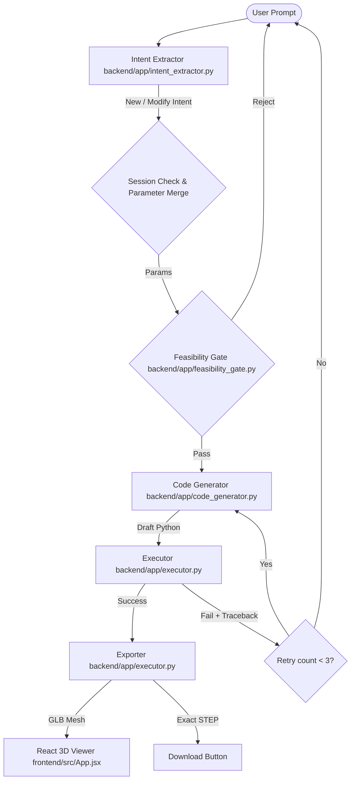

# System Architecture

## 1. System Data Flow

## 2. Module Responsibility Table

| Module Name | Responsibilities | What It Must NEVER Do |
| :--- | :--- | :--- |
| **Intent Extractor** | Extract CAD parameters and primitive types; classify request as `new` vs `modify` using Ollama. | Execute python code or run feasibility rules. |
| **Feasibility Gate** | Verify geometry bounds (wall thickness, gear bore constraints, non-negativity) using Pint. | Invoke LLMs or run shell commands. |
| **Code Generator** | Prompt LLM to produce or modify python scripts using CadQuery with Chain of Thought reasoning. | Perform execution or file writing. |
| **Executor** | Run code in a subprocess with a timeout and resource constraints, capture output, export assets (STEP, STL, GLB). | Correct syntax or write business logic. |
| **FastAPI Backend** | Expose API endpoints, orchestrate pipeline, manage in-memory session history for stateful multi-turn editing. | Directly call the CAD engine geometry core inside the main API process. |
| **React Frontend** | Input prompt, show step logs, track session IDs, render 3D GLB mesh with smooth normals, display generated code. | Run CAD calculations or call LLM directly. |

## 3. Supported Feature Catalog (v1)

We classify every supported shape/operation into three states of verification:
* **Verified**: Validated by a structurally distinct generalization test using held-out prompts.
* **Scaffolded**: Has a worked example, compiles, but held-out parameters/phrasing are untested.
* **Planned**: Scoped for MVP but has no worked examples or generalization test coverage yet.

| Shape/Feature | Verification State | Notes |
| :--- | :--- | :--- |
| **Box / Cuboid** | Verified | Tested via standard box and chamfered box. |
| **Cylinder** | Verified | Tested via cylindrical rod. |
| **Spur Gear** | Verified | Generalizes to teeth/module parameters. Chained bore edits verified. |
| **Bracket / Mounting Plate** | Verified | Bracket with hole grid and fillet chains verified. |
| **Sphere** | Verified | Tested via Sphere with Flat Cut (boolean cut). |
| **Cone** | Verified | Tested via Cone Frustum (cq.Solid.makeCone). |
| **Sketch + Extrude (Polygon/Circular)** | Verified | Tested via Hexagonal Plate Pattern. |
| **Sketch + Revolve** | Verified | Tested via Revolved Bushing (L-shaped profile). |
| **Holes (Counterbore, Countersink)** | Planned | Scoped, but untested. |
| **Fillets & Chamfers** | Verified | Tested via fillets (vertical edges) and chamfers. |
| **Linear & Circular Patterns** | Verified | Tested via polarArray circular hole patterns. |
| **Boolean Ops (Union, Cut, Intersect)** | Verified | Tested via boolean cuts (sphere slice, bore cuts). |

## 4. Architectural Distinctions

- **GLB Mesh Preview vs Exact STEP Delivery**: The engine outputs exact B-Rep geometry via the **STEP** file (preserving original CAD math for downstream machining). However, to prevent rough, faceted "golf ball" rendering in three.js, the executor also outputs a size-aware binary **GLB/glTF** preview mesh using custom deflection tolerances (`tolerance = max(1e-4, min(0.5, diag * 0.0015))` and `angularTolerance = 0.05`) rendered with smooth shading.
- **Dynamic few-shot RAG**: Replaced static system prompt examples with dynamic retrieval from a local example corpus using ChromaDB and Ollama embeddings.
- **In-Memory Session Store**: Multi-turn modifications are driven by an in-memory session dictionary on the backend. This matches raw parameter history and merges incoming edits before running them through the feasibility gate and code generator.

## 5. Implementation Status

- **Complete**: FastAPI Backend, React Frontend + Monaco Code Panel + Three.js 3D GLB viewer. ChromaDB vector database and dynamic few-shot retrieval. Generalization test suite. Latency benchmarking harness. Stateful multi-turn iterative editing.
